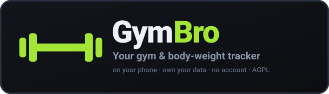

<div align="center">



<br>

**Your gym & body-weight tracker — on your phone, and yours to keep.**

Plan your week, run guided workouts, track every set and your body weight over time.
No account, no subscription, no ads, no telemetry. The standalone app keeps everything
on the device; self-host the same code and you get passkey sign-in and sync across devices.

<br>

[](LICENSE)


</div>

<br>

> ### 🍴 GymBro is a fork
>
> GymBro is a renamed, store-ready fork of **[openGym](https://github.com/DuarteSantos8/openGym)**
> by Duarte Santos, taken by way of [emilfunk/opengym](https://github.com/emilfunk/opengym)
> (which added the AI Coach). It stays **AGPL-3.0** — see [LICENSE](LICENSE) and
> [NOTICE.md](NOTICE.md) for what changed and who wrote what.
>
> What this fork adds: the GymBro identity (`io.github.moyibr.gymbro`), release signing,
> icons, CI that builds store artifacts, and the App Store / Play Store submission kit
> under [`store/`](store/).

<br>

<div align="center">
<table>
<tr>
<td align="center"><br><sub><b>Home</b> — today's workout & weight</sub></td>
<td align="center"><br><sub><b>Guided workout</b> — animated demos & sets</sub></td>
<td align="center"><br><sub><b>Stats</b> — heatmap, charts & PRs</sub></td>
</tr>
</table>
</div>

## The two flavors

GymBro builds two ways from one codebase.

| | **Mobile app** (`npm run build:mobile`) | **Self-hosted** (`docker compose up`) |
|---|---|---|
| Runs | natively on iPhone / Android (Capacitor) | any browser, against your own server |
| Accounts | none — the phone *is* the account | passkey sign-in, one profile per person |
| Data | on the device, in the app's private storage | your server, synced across devices |
| Reminders | native local notifications | Web Push from your server |
| AI Coach | not included | optional, on your own provider account |

The **mobile app is what ships to the stores** — it never talks to a backend, so there is
nothing to run and nothing to pay for. The self-hosted flavor is untouched and still works.

## Features

- ⚖️ **Body-weight tracking** — interactive chart with a goal line you set, gains/losses colored by whether they move toward it
- 🏋️ **Weekly plan** — a routine per weekday, over a library of **1,324 exercises** (searchable, with animated demos)
- 🗓️ **Reschedule any day** — sick, missed a session, or fewer gym days this week? Move a workout to another day without touching your weekly plan
- ▶️ **Guided workouts** — it knows what day it is and starts today's session; asks your body weight first, pre-fills your weights from last time, rest timer, PR detection, per-exercise weight tracking
- ☀️ **The screen stays awake while you train** — on for as long as a workout is running, released the moment you finish it, and switchable off in Settings
- 🔗 **Supersets** — build them, and log them back-to-back with a rest only after the pair
- ⏱️ **Timed exercises** — planks, hangs, wall sits and loaded carries are logged by time, not reps, with a work timer separate from the rest timer. They can carry weight too
- 📈 **Progression that follows a rule** — pick one per routine, override it per exercise: linear, **Greyskull LP**, double progression through a rep range, or adding time. Every target says *why* it's that number; missed reps never advance the load, stalls trigger a deload, bodyweight exercises progress in reps
- 💪 **Estimated 1RM** — per exercise, from your best eligible set, with its own progress curve and a calculator for sets you haven't done
- 🎯 **Effort per set** — optional **RIR** or **RPE** column; each set keeps the scale it was logged with, and nothing else reads the value
- 🏃 **Cardio** — log time + speed, not just weight × reps
- 📤 **Share a plan** — send someone your routines and week schedule as a small file (no workouts, no weigh-ins), or print it as a clean PDF. Importing merges, so their plan is never overwritten
- 🔧 **Filter by equipment** — narrow the library to what you actually own
- ✨ **Your own exercises** — a name and a body part is enough; they behave like built-in ones everywhere
- 🟩 **Activity heatmap** — a GitHub-style year view, shaded by time spent training
- 💪 **Muscle map** — front-and-back body diagram shaded by how much work each muscle got, over a week, a month or all time
- 🔔 **Workout reminders** — native local notifications on the days you have a workout planned (the mobile app), or Web Push rest-timer alerts when self-hosted
- 🎨 **Designed, not assembled** — light/dark themes and 8 accent colors, over a hand-drawn icon set instead of emoji
- 🌍 **12 languages** — full UI translation (EN, DE, ES, FR, IT, PT, PL, TR, RU, ZH, KO, HI); exercise instructions localized in 10 of them
- 📥 **Bring your history with you** — import from **FitNotes**, **Strong** and **Hevy**, or body weight from an **Apple Health** export
- 📦 **Yours to keep** — one-tap JSON export/import, **no telemetry**
- 🔑 **Passkeys and sync** (self-hosted only) — Face ID / Touch ID login, one profile per person
- 🤖 **AI Coach** (self-hosted only, optional) — an AI that designs your plan and revises it from what you log. **[Full guide →](docs/AI_COACH.md)**

## Build the mobile app

```bash
cd frontend
npm ci
npm run build:mobile      # offline bundle + `cap sync` into android/ and ios/

npx cap open android      # Android Studio → run on a device or emulator
npx cap open ios          # Xcode (Mac only) → set your signing team, then run
```

Full instructions, icons and signing: **[docs/MOBILE.md](docs/MOBILE.md)**.
Cutting a store release: **[docs/RELEASE.md](docs/RELEASE.md)** and **[store/README.md](store/README.md)**.

## Quick start (self-host)

You need [Docker](https://docs.docker.com/get-docker/) with Compose.

```bash
git clone https://github.com/moyibr/GymBro-Training
cd GymBro-Training
cp .env.example .env
docker compose up -d --build
```

Open **http://localhost:8080**, tap **Create profile**, and you're in. First launch downloads
the exercise media (~140 MB) once.

> Want it reachable from your phone over the internet with passkeys? You'll need an HTTPS
> domain — a two-line change in `.env`. See **[docs/SELF_HOSTING.md](docs/SELF_HOSTING.md)**.

## How it works

```
┌─────────────┐        ┌──────────────────────────────┐
│  Your phone │──HTTPS─▶│  web  (nginx)                │
│  / laptop   │        │   ├─ serves the built app    │
└─────────────┘        │   └─ proxies /api ──────────┐│
                       └──────────────────────────────┘│
                                                        ▼
                                        ┌──────────────────────────┐
                                        │  api  (Node + WebAuthn)  │
                                        │   └─ ./data (JSON files) │
                                        └──────────────────────────┘
```

- **frontend/** — React + Vite (React Router + Zustand); also the Capacitor host for `android/` and `ios/`
- **api/** — Node with no framework, storing everything as plain JSON files under `./data`
- **web/** — a multi-stage image that builds the frontend and serves it with nginx, proxying `/api` to the backend so it's all on **one origin** (passkeys require this)
- **store/** — everything the two app stores ask for: listing copy, privacy answers, screenshot specs, release checklist

The mobile app uses none of the server half: state is mirrored from `localStorage` into
`gymbro-state.json` in the app's private data directory on every change, and restored on launch.

## Your data

**Mobile app:** on the phone only, in the app's private storage. Nothing is uploaded, there is
no analytics SDK, and backups leave through the OS share sheet when you ask for one.

**Self-hosted:** in `./data` on your host — `db.json` (profiles + public passkeys),
`state-<user>.json` (each user's plan, workouts, body weight, settings), and `secret`.
Back up `./data` and you've backed up everything.

Exercise images and animations are fetched from the [jsDelivr](https://www.jsdelivr.com) CDN in
the mobile app (they are ~140 MB, far too much to bundle), so exercise demos need a connection —
everything else works offline.

## Configuration (self-hosted)

All via `.env` (see `.env.example`):

| Variable      | What it is                                           | Default                 |
|---------------|------------------------------------------------------|-------------------------|
| `RP_ID`       | Hostname passkeys are bound to                       | `localhost`             |
| `ORIGIN`      | Full URL the app is served from                      | `http://localhost:8080` |
| `WEB_PORT`    | Host port for the web UI                             | `8080`                  |
| `RP_NAME`     | Name shown in the passkey prompt                     | `GymBro`                |
| `ADMIN_UIDS`  | User ids that get the admin dashboard (comma-separated) | *(none)*             |
| `INVITE_ONLY` | Require an invite code to create a profile           | *(off)*                 |
| `COACH_DISABLED` | Force the AI Coach off, whatever the admin dashboard says | *(unset)*        |

## Tech

React 19 + Vite (React Router, Zustand) · Capacitor 7 · Node (no framework) · nginx ·
Docker Compose · WebAuthn · exercise data from
[hasaneyldrm/exercises-dataset](https://github.com/hasaneyldrm/exercises-dataset).

The training logic — progression rules, 1RM estimation, how a logged session is read back —
lives in pure functions under `frontend/src/lib/` with tests next to them: `npm test` in
`frontend/`.

## Contributing

Issues and PRs welcome — see [CONTRIBUTING.md](CONTRIBUTING.md). Fixes that aren't
GymBro-specific belong upstream in [openGym](https://github.com/DuarteSantos8/openGym), where
more people will get them.

## License

[GNU AGPL v3.0](LICENSE) — free and open source. You can use, modify and share it; if you run a
modified version as a network service, you must offer that version's source under the same
license. The copyright holder's **app-store exception** (an additional permission under AGPL §7,
in [NOTICE.md](NOTICE.md)) is what lets this fork be distributed through Google Play and the
App Store, on the condition that the source stays available under the AGPL.

Exercise images/GIFs come from the upstream dataset and keep their own terms — see
[NOTICE.md](NOTICE.md).
